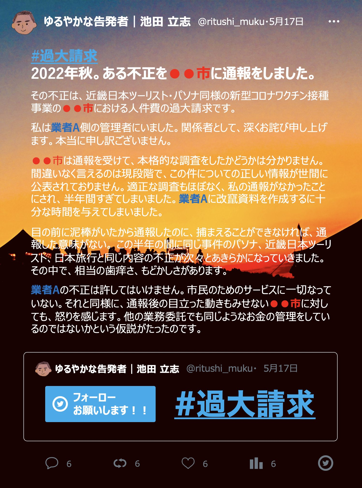

# ある不正を●●市に通報をしました{-}

{ width=50% style="float: left; margin-right: 10px;" }

**2022年秋。ある不正を●●市に通報をしました。**

その不正は、近畿日本ツーリスト・パソナ同様の新型コロナワクチン接種事業の**●●市**における人件費の過大請求です。

私は**業者A**側の管理者にいました。関係者として、深く関わっていたのも事実です。私の力及ばずで、ご迷惑をおかけしております。心からお詫び申し上げます。本当に申し訳ございません。

●●市は通報を受けて、本格的な調査をしたかどうかは分かりません。間違いなく言えるのは現段階で、この件についての正しい情報が世間に公表されておりません。適正な調査もほぼなく、私の通報がなかったことにされ、半年間すぎてしまいました。**業者A**に改竄資料を作成するに十分な時間を与えてしまいました。

目の前に泥棒がいたから通報したのに、捕まえることができなければ、通報した意味がない。 この半年の間に同じ事件のパソナ、近畿日本ツーリスト、日本旅行と同じ内容の不正が次々とあきらかになっていきました。その中で、相当の歯痒さ、もどかしさがあります。

**業者A**の不正は許してはいけません。市民のためのサービスに一切なっていない。それと同様に、通報後の目立った動きもみせない●●市に対しても、怒りを感じます。●●市は、他の業務委託でも同じようなお金の管理をしているのではないかという仮説がたったのです。

とにかく私が良くないなと思っているのが、業者Aの嘘がバレないことによって、これからも嘘をつき続けます。現状は杜撰で陳腐であり、何も管理がされていない仕事になっています。また、改竄や嘘をつくための仕事が公金で支払われていることです。一度大きな嘘をつくと、嘘をつき続ける嘘を終わるまでずっとつかなくはいけない。そのための仕事が発生している現状です。私は一人の社会人としてとても恥ずかしい仕事だと思います。

世の中のためにならない仕事を少しでもなくせるように、減らせるように。現実を知っている一員として私は声をあげていきます。

※画像を添付している理由は少しでも楽しくTweetするための工夫です（笑）本心はとても真面目です。