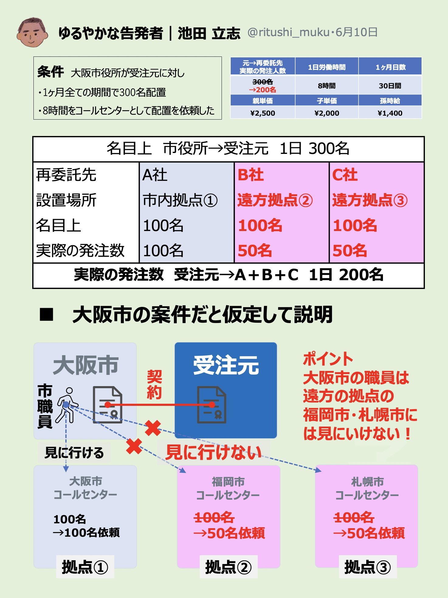

# コロナ過大請求、遠方拠点詐欺の手口を紹介{-}

{ width=50% style="float: left; margin-right: 10px;" }
※ 例なので大阪市は全く関係がありません ※

コロナ過大請求 
遠方拠点詐欺の手口を紹介

大阪市の案件を 
大阪市・福岡市・札幌市の拠点に分ける 
↓↓↓ 
市の職員が見に行けない遠方現場を 
あらかじめ予定席数よりも減らして業務実施（100依頼→50名発注） 
↓↓↓ 
出勤表などの改竄資料を作成しそれを元に満額請求をする。